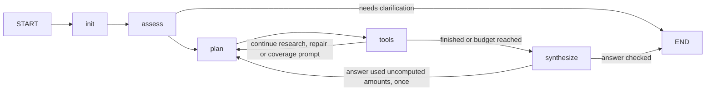

# Health Insurance Document Agent

`health_insurance_document_agent` answers questions across selected health-insurance documents and tables using Llama 4 Maverick or Claude 4.5 through Amazon Bedrock. It includes a local chat interface, document extraction, source evidence, and deterministic table tools. The document agent is the sole LangGraph workflow; chat, CLI, and evaluations share it. Existing S3 preprocessing paths remain supported.

## Project layout

All commands below run from the project root. Python command-line programs run with `-m` so
package imports resolve consistently; the Streamlit entry point is `apps/chat/app.py`.

```text
backend/         Reusable application backend
  entrypoint.py  ask_question: the single entry point for answering a question
  agents/        Sole LangGraph workflow, native protocol, Bedrock and evidence
  tools/         Document and deterministic table tools
  retrieval/     Search over extracted document blocks
  preprocessing/ Extraction and workbook-to-CSV conversion
  storage/       Local/S3 persistence and table loading
  shared/        Document model, metadata summaries and serialization
  config/        Model settings
  observability/ Audit records and Datadog LLM Observability spans
apps/            Replaceable Streamlit interfaces
  api/           AWS Lambda handler that calls ask_question
  chat/app.py    Saved-document selection and questions (port 8501)
  upload/app.py  Upload, preprocessing and saving (port 8502)
development/     Utilities and tests, not required by the backend
  cli/           Single-file command-line runner
  evaluation/    Live model evaluations
  observability/ Local in-memory stand-in for Datadog LLM Observability
  scripts/       Sample-data generator
  tests/         Offline regression tests
  fixtures/      Reviewed test documents and expected answers
  runs/          Evaluation reports and traces (ignored by Git)
transfer/        Source bundle, create_bundle.py, and standalone restore_repo.py
data/            Local documents and shared library (ignored by Git)
```

`backend/preprocessing/documents.py` creates document records; `backend/retrieval/search.py` searches them.
The shared `Document` record lives in `backend/shared/models.py`. Preprocessing and storage do not
import the agent runtime. `backend/storage/tables.py` loads the same preprocessed CSV contract through
either a real S3 client or the local adapter. This preserves the AWS object layout.

Dependencies and local configuration stay at the root (`requirements*.txt`, `.env.example`,
`.env`, and `.streamlit/`). `.venv/`, `__pycache__/`, and `.pytest_cache/` are managed
dependency/cache folders, not application code.

Integrations call `backend.entrypoint.ask_question`; local tools call `ask_question_local` (see "Entry point"
below). The LangGraph workflow in
`backend.agents.document_agent` is an internal detail that does not validate requests or write audit records.

## Multi-file chat prototype

After installing dependencies and configuring your local AWS profile, start the interface:

```powershell
.\.venv\Scripts\python -m streamlit run apps/chat/app.py
```

In a second terminal, start the upload portal:

```powershell
.\.venv\Scripts\python -m streamlit run apps/upload/app.py --server.port 8502
```

Open http://127.0.0.1:8502 to upload and preprocess files, or click **Load Bingle-Dingle examples** there. Open http://127.0.0.1:8501 for chat, click **Refresh saved files**, and use **Files to answer from** to select sources. Changing selected files or model clears the conversation to keep comparisons independent.

The interface accepts text PDFs, DOCX, XLSX, XLS, CSV, TXT, and Markdown, with at most 10 files per upload batch or chat selection and 20 MB per file. PDF references use page numbers; Word references use paragraph/table locations; spreadsheets preserve sheet and row references. Extraction warnings and the retrieved evidence appear alongside answers. Choose Maverick or Claude Haiku/Sonnet/Opus 4.5; `BEDROCK_MODEL_ID`, if set, overrides that choice.

`backend/preprocessing/documents.py` handles document extraction and chunking. `backend/retrieval/search.py` searches the extracted blocks. `backend/agents/document_agent.py` limits every tool to the selected document IDs and reuses the existing Bedrock wrapper. Table questions use validated filters, aggregates and within-workbook joins. Generated Python execution is disabled in this chat interface. `apps/chat/app.py` keeps chat and active selections in session memory; selected excerpts and conversation context are sent to Bedrock. Setting `DOCUMENTS_STORAGE=s3` and `DOCUMENTS_S3_BUCKET` enables persistent originals and preprocessed content through `backend/storage/s3.py`. The default `DOCUMENTS_STORAGE=local` persists files in `data/document_library` and makes no S3 calls. Both apps share this directory; set `DOCUMENTS_LOCAL_DIR` to override it (relative paths resolve from the project root). Uploading and preprocessing do not call Bedrock.

This is a localhost development application, without user authentication. Optional S3 storage is scoped to the server-configured bucket and prefix. File selection is question scope, not a replacement for authorization. A shared deployment needs server-enforced user/document permissions, hardened ingestion, resource limits, and persistent versioned source storage. Automatic bucket discovery, OCR, cross-file table joins, and semantic retrieval are not implemented. PDF layout and Word headers, footers, text boxes, and tracked changes may not extract completely. Citations identify retrieved evidence; they do not independently prove that a model interpreted it correctly.

**Load Bingle-Dingle examples** loads eight Bingle-Dingle health-insurance documents: provider agreement, rate schedule, executed amendment, processing guide, unexecuted draft, benefit summary, authorization rules, and claim packet. Bingle-Dingle Insurance is a regional health insurer offering the Meadow product. The documents cover provider terms, benefits, authorization, and claim-specific records.

Try: "For claim 0012, explain the allowed amount, member responsibility, and insurer estimate." The complete selected packet supports an allowed amount of USD 176.00, member responsibility of USD 75.20, and insurer estimate of USD 100.80 under explicit simplified assumptions. These differ from the billed USD 220.00 and from a final payment decision. Deselect the benefit summary and repeat: the agent should identify missing terms instead of using the previous answer.

Thirteen document evaluation cases cover effective dates, draft precedence, product scope, missing sources, authorization, benefit utilization, and cost sharing:

```powershell
.\.venv\Scripts\python -m development.evaluation.documents --model maverick --output development\runs\documents-maverick.jsonl
```

This makes billable model calls. Results require human comparison with the expected answers; offline tests use scripted responses and do not measure model quality.

## Native tools and model comparison

The document agent uses native Bedrock Converse `toolConfig`, `toolUse`, and matching
`toolResult` messages. The chat app, local CLI, streaming entry point, and both evaluation CLIs all use this workflow. Model choice is independent of tool calling:
Maverick and Claude Haiku/Sonnet/Opus 4.5 all use the same native protocol.
There is no prompt-based JSON tool planner or automatic fallback. Unsupported model/API
configurations fail explicitly. Final answer writing returns text through Converse; its response is never parsed as a tool request.

Native requests are validated before execution. Selected document/sheet restrictions, duplicate
request handling, multiple calls per turn, evidence attribution, and bounded corrective retries
remain in place. The agent permits at most two corrective retries per question, sixteen planner turns, and sixteen tool executions. Every received native call gets a matching result before another planner turn.
An early finish without supporting content is rejected. A valid tool request does not guarantee
correct document interpretation or arithmetic.

Select a model in the app, pass `model=` to `run_document_agent()`, or use `--model` on either CLI.
The default model comes from the `TABLES_MODEL` environment variable. `BEDROCK_MODEL_ID`
can select a deployment-specific native-tool-capable inference profile.

Run matched evaluations with local files and real Bedrock models (output paths must be new):

```powershell
.\.venv\Scripts\python -m development.evaluation.documents --model maverick --output development\runs\maverick-native.jsonl --traces development\runs\maverick-native-traces
.\.venv\Scripts\python -m development.evaluation.documents --model claude-haiku-4.5 --output development\runs\haiku-native.jsonl
.\.venv\Scripts\python -m development.evaluation.documents --model claude-sonnet-4.5 --output development\runs\sonnet-native.jsonl
.\.venv\Scripts\python -m development.evaluation.documents --model claude-opus-4.5 --output development\runs\opus-native.jsonl
```

Expected answers remain outside model inputs. Reports retain actual model IDs, native protocol,
latency, usage, evidence and answers. Traces (every model call with its prompt and response) contain document
content and are optional;
`development/runs/` is ignored by Git. Review correctness separately from protocol success.

## Quick start (PowerShell)

Python 3.11+ is required. From this project directory:

```powershell
python -m venv .venv
.\.venv\Scripts\python -m pip install -r requirements-dev.txt
Copy-Item .env.example .env
.\.venv\Scripts\python -m development.scripts.make_samples
.\.venv\Scripts\python -m pytest -q
```

If your Python installation cannot bootstrap pip, use `python -m pip --python .\.venv\Scripts\python.exe install -r requirements-dev.txt`.

Inspect preprocessing without credentials or model calls:

```powershell
.\.venv\Scripts\python -m development.cli.run_local data\insurance_mappings.xlsx "Inspect" --inspect
```

Run the real agent using your existing local AWS profile:

```powershell
.\.venv\Scripts\python -m development.cli.run_local data\insurance_mappings.xlsx "What is the total known billed amount in Claim Samples?" --profile dev-profile --model maverick --trace development\runs\maverick.json
.\.venv\Scripts\python -m development.cli.run_local data\insurance_claims.csv "What is the total known billed amount?" --profile dev-profile --model maverick --stream
```

Replace the file path and question to test your own files. CSV options include `--encoding cp1252` and `--delimiter ';'`. `.xlsx` and `.xls` files load all worksheets. The local preprocessor detects headers below title rows and preserves free-text metadata sheets. Explicit header/type overrides handle ambiguous layouts. Multiple tables per sheet and uncached formulas are not supported. See development/fixtures/README.md for details.

Expected table results: known billed amount **USD 445**, one missing amount (claim **0015**) and one zero amount (claim **0016**). Claim **0012** retains its leading zeros. The workbook includes narrative About and Version History sheets, mappings with duplicates and draft status, repeated headers, and source-row provenance. These independent parser samples are not a combined claim ledger for the narrative packet.

## Personal AWS setup

Local data + personal-account Bedrock closely reproduces the existing LLM API without creating a bucket. Configure a named AWS SDK profile using your account's normal credentials or IAM Identity Center flow (`aws configure sso --profile dev-profile`, then `aws sso login --profile dev-profile`, when applicable). Do not put access keys in Python files. Use synthetic data initially; local loading still sends samples, schemas, and tool results to Bedrock. Calls incur AWS charges.

Set `AWS_PROFILE=dev-profile` in `.env`, or pass `--profile`. The default region is `us-east-1`; use `--region` to override it. The account/role needs `bedrock:InvokeModel` permission for the selected inference profile and underlying models in its destination regions. Organizational policies, regional availability, and account access can also affect invocation. No S3 permissions are needed for local mode.

Defaults:

| Selection | Bedrock inference profile |
| --- | --- |
| maverick | `us.meta.llama4-maverick-17b-instruct-v1:0` |
| claude-haiku-4.5 | `us.anthropic.claude-haiku-4-5-20251001-v1:0` |
| claude-sonnet-4.5 | `us.anthropic.claude-sonnet-4-5-20250929-v1:0` |
| claude-opus-4.5 | `us.anthropic.claude-opus-4-5-20251101-v1:0` |

`BEDROCK_MODEL_ID` overrides the selection when your deployment uses a specific inference profile ARN or ID. Remove that override when comparing models with `--model`. `BEDROCK_MAX_TOKENS` controls the output limit per call. These US profiles may route requests across US regions.

AWS references: [Maverick](https://docs.aws.amazon.com/bedrock/latest/userguide/model-card-meta-llama-4-maverick-17b-instruct.html), [using inference profiles](https://docs.aws.amazon.com/bedrock/latest/userguide/inference-profiles-use.html).

## Files and AWS migration

- `backend/agents/document_agent.py`: the sole LangGraph workflow, with native tools, bounded retries, streaming, selected-source restrictions, and evidence.
- `backend/agents/llm.py`: Bedrock Converse wrapper with normal SDK profile/role credentials, configurable region, timeouts, and retries.
- `backend/config/settings.py`: Llama and Claude model IDs and environment-based inference settings.
- `backend/storage/local.py`: in-memory `get_object` adapter and metadata generation; no AWS calls.
- `development/cli/run_local.py`: CLI with optional model-call traces and token totals. Trace files contain input data and are ignored by Git.
- `development/scripts/make_samples.py`: deterministic sample files.
- `development/tests/`: offline regression tests. Agent tests use scripted LLM responses with the real graph and tools; they do not measure answer quality.

For existing AWS preprocessing outputs, load a document and call the sole agent:

```python
from backend.preprocessing.documents import document_from_table_inputs
from backend.agents.document_agent import run_document_agent

# s3_client is your existing configured S3 client.
doc = document_from_table_inputs(
    s3_client=s3_client,
    s3_bucket="your-bucket",
    s3_prefix="your-prefix/",
    plan_domain="your-domain",
    filename="your-workbook.xlsx",
)
result = run_document_agent({doc.id: doc}, [doc.id], "What is the total known billed amount?")
print(result["answer"])
```

`document_from_table_inputs()` reads the existing CSV/metadata contract through either a
local adapter or S3. It adds searchable text and table metadata without running another agent.
For saved multi-file libraries, use `store.load(manifest_key)` and pass the selected document
records to the same agent. `run_document_agent_stream()` streams sanitized node progress and
a final answer from this graph.

Use the deployment's IAM role by leaving `AWS_PROFILE` unset. Do not copy the personal `.env` into AWS. The S3 prefix must include its trailing slash. Existing preprocessing must provide `_metadata.json` plus each sheet's CSV at `{prefix}{domain}/preprocessed/{filename}/`; for CSV inputs the object basename is the original CSV filename. The new backend/preprocessing/tables.py exports that contract locally; it does not upload to S3 or validate another preprocessing pipeline.

## Limits of this development harness

The CLI and chat expose the same deterministic table tools. Generated Python execution and
sampled parallel summaries were removed with the duplicate table workflow. Search results
can be truncated, and tool failures or step limits may yield incomplete answers. Repeated
identical calls reuse evidence. CLI calls are independent; Python callers can pass `history`.

Deterministic `query_table` supports filters, grouping, sorting, pagination, decimal aggregates, and explicit unit conversions. `join_tables` checks relationship constraints and caps output size. Decimal arithmetic preserves loaded numeric values; it cannot restore precision already lost in a source workbook. Missing totals remain missing instead of silently becoming zero. The evidence pipeline bounds model context and retains tool parameters and source references. Its numeric display check is a guard against omitted exact values, not a semantic answer verifier.

For model evaluation, run the same questions with both models and compare answers to known totals. Inspect traces for tool selection, evidence, failures, and token use. Offline passing tests are not evidence that a live AWS profile or model invocation works.


## Publishing to GitHub

Commit source code, tests, dependency files, and `.env.example`. The example uses a placeholder profile name; keep your actual settings in `.env` (ignored by Git). AWS login credentials remain in your user-level AWS configuration/cache outside this project; the source code loads them through the SDK and contains no account-specific credentials.

The ignore rules exclude `.env` variants, `.aws` folders, credential/key files, logs, local data, model traces under `development/runs/`, spreadsheet inputs, and the virtual environment. Keep traces in `development/runs/` even when choosing a custom `--trace` path. Ignore rules do not remove files already committed, and do not protect files uploaded manually through the GitHub website. Do not upload a ZIP of the entire working directory.

Before each push, inspect `git status --short` and `git diff --cached`. Add any deliberate sample fixtures explicitly only after verifying they are synthetic. Do not force-add local configuration, credentials, or real spreadsheets.


## Messy workbook development

The [insurance fixtures](development/fixtures/README.md) cover narrative sheets, cross-system claim attribute mappings, duplicates, draft mappings, missing values, and leading-zero IDs. Run `development/scripts/make_samples.py` to generate the workbook and CSV under ignored `data/`; tests create independent temporary copies.

`backend/preprocessing/tables.py` exports each sheet to CSV plus metadata with types, counts, frequent values, source row positions, and parsing warnings. `backend/storage/local.py` uses it automatically, or `development/cli/run_local.py --preprocessed` loads a previously exported directory. `read_sheet` provides paginated access to narrative content and full table rows; search now includes metadata sheets. `development/evaluation/tables.py` runs known-answer questions through a selected model and saves results for human review under `development/runs/`.


## Persistent preprocessing in S3

Use an existing bucket. Set these values in your ignored `.env` and restart Streamlit:

```dotenv
DOCUMENTS_STORAGE=s3
DOCUMENTS_S3_BUCKET=your-bucket
DOCUMENTS_S3_PREFIX=document-agent/
# Optional KMS override; otherwise the bucket encryption policy applies:
# DOCUMENTS_S3_KMS_KEY_ID=your-key-id
```

The app uses `AWS_PROFILE` for local development or the deployment IAM role when unset. Uploaded files and the example-loader files are saved automatically when S3 is configured. A failed save reports an error rather than silently falling back to local storage. Chat history is not persisted. Clearing files/chat does not delete S3 objects.

In the chat app, click **Refresh saved files** and select sources under **Files to answer from**. The upload portal handles all ingestion; the chat app opens its store in read-only mode. In production, give the chat service a read-only storage role and the separate upload service write permissions. The picker shows up to 100 saved documents from the configured prefix; this is a prototype library, not automatic retrieval across a bucket. Everyone using this app configuration has the same storage scope; add authentication and server-side authorization before a shared deployment.

Documents are stored by their full filename, including extension:

```text
<prefix>/documents/
  raw/
    benefits.pdf
    claims.xlsx
  preprocessed/
    benefits.pdf/
      extracted.json
      manifest.json
    claims.xlsx/
      extracted.json
      manifest.json
      _metadata.json
      <sheet>.csv
```

`extracted.json` preserves text blocks, source locations, warnings, and table metadata. The manifest is written last. Re-uploading the same filename replaces its raw file and preprocessed outputs; use distinct filenames to retain separate documents. The previous manifest and outputs are removed before replacement so a failed upload cannot be opened as complete. A failed replacement requires re-uploading the source; this is not an atomic transaction or version-history system. Concurrent writes to the same filename are not supported. Bucket versioning may be enabled separately if recovery history is required.

Table inputs use `s3_prefix=<prefix>/`, `plan_domain=documents`, and `filename=<filename>`, preserving the existing preprocessing reading contract. Saved documents reopen without re-extraction; table queries read CSVs directly from S3.

The configured identity needs `s3:PutObject`, `s3:GetObject`, and `s3:DeleteObject` on the chosen object prefix, `s3:ListBucket` restricted to that prefix for the saved-file picker, and `s3:AbortMultipartUpload` for transfer cleanup. A KMS-encrypted bucket/key may also require `kms:GenerateDataKey` and `kms:Decrypt` plus an appropriate key policy. This code does not create buckets, modify policies, add public access, or offer a delete-file UI. Replacement does remove prior preprocessed objects for that filename.

Programmatic usage: pass `store=configured_store()` to `backend.preprocessing.documents.ingest_document(name, content_bytes, store=store)`. Keep and use the returned document's `storage_ref['manifest_key']` with `store.load(...)`. Existing calls without a store remain local.

For development, set `DOCUMENTS_STORAGE=local` and restart the app. You can leave the bucket and prefix configured; local mode ignores them. AWS integrations must retain local/offline alternatives for development and tests. Bedrock answers still require AWS; preprocessing and offline tests do not.

The upload portal calls `ingest_document(..., store=store)`; a future portal can reuse this backend/preprocessing/storage boundary without importing Streamlit or the agent. `backend/storage/documents.py` shares the manifest contract between S3 and `backend/storage/filesystem.py`. Local files use the same `documents/raw/<filename>` and `documents/preprocessed/<filename>/` layout. Chat history remains session-only. Selected sources reload on each interaction; source-content changes clear prior chat. Avoid replacing a selected document while a question is running, since table files are read lazily and storage replacement is not transactional.

## LangGraph workflows

The document agent uses LangGraph for every answering entry point. Native Bedrock tool calling
remains the model protocol; LangGraph controls which Python node runs next.
The document workflow in `backend/agents/document_agent.py` is:



`DocumentState` names the data passed between nodes. `init` validates selected sources and
creates the per-run native conversation. `assess` optionally checks the question for ambiguity (see
"Ambiguous questions"). `plan` requests model tool calls. `tools` validates
and executes them, records evidence, and returns matching native tool results.
`route_after_tools` chooses another planning turn or answer synthesis; `route_after_synthesize`
can send the planner back once to compute amounts (see below). The graph preserves the
sixteen-turn/sixteen-execution cap and two corrective retries. `run_document_agent()`
invokes the compiled graph and returns the same result shape used by Streamlit and evaluations.

For learning/debugging, `DOCUMENT_GRAPH.get_graph().draw_mermaid()` prints its diagram.
`DOCUMENT_GRAPH.stream(inputs, stream_mode="updates", config={"recursion_limit": 42})`
exposes node updates, where inputs contain `documents`, `document_ids`, and `question`.
Raw updates contain document content and runtime objects; keep them out of public logs.
This is an in-memory workflow, without durable checkpoints or restart/resume support.

`backend/tools/documents.py` dispatches selected-document tools; `backend/tools/tables.py` dispatches the six
shared deterministic table tools; `backend/tools/table_operations.py` implements queries and joins.
These modules never import the agent. The agent uses `backend/agents/native.py` for native protocol handling and validation;
document-specific schemas remain in `backend/agents/document_protocol.py`. Shared result conversion
lives in `backend/shared/serialization.py`. Uploading, preprocessing, and storage remain ordinary
Python services rather than agent workflows.

Run commands from the repository root. `backend/` does not import `apps/` or `development/`. The upload app’s optional example-loader reads development fixtures; ordinary uploads do not need them. Root dependency files, `.env`, and `.streamlit/` remain shared configuration. Existing local data and S3 object paths are unchanged.

## Portable text bundle

`transfer/` contains:
- `repository-bundle.txt`: generated UTF-8 source snapshot, excluding itself.
- `create_bundle.py`: creates or refreshes the snapshot using Git's file list.
- `restore_repo.py`: standalone restoration script requiring only Python 3.11+.

From the project root, regenerate after source changes:

```powershell
.\.venv\Scripts\python transfer/create_bundle.py
```

Copy the complete bundle into a UTF-8 text file and separately copy `restore_repo.py`.
Place those two files together on the destination machine and run:

```powershell
python restore_repo.py repository-bundle.txt restored-project
```

Headers give each relative path, content length, and checksum; the parser verifies all content
before writing. Existing destination folders are rejected. Text line endings normalize to LF.
Both transfer scripts are included inside the snapshot; the snapshot itself is excluded to
prevent recursive growth. Git permits the generated snapshot under `transfer/`, so refresh
and review it before publishing. Local configuration, credentials, data, reports, dependencies,
and Git history are excluded. Install project dependencies and configure the environment separately.

## Calculations, source coverage and answer checks

These controls target failures seen in live evaluations: mental arithmetic with an outdated rate,
unread amendments, and answers stating what the insurer "will pay".

- **Deterministic calculations** (`backend/tools/calculations.py`). `calculate` evaluates an
  expression of literal numbers with exact decimals, e.g. `{"label":"allowed","expression":"2 * 88.00",
  "sources":["E2","question"]}`. Every number must appear in a cited evidence record or the question
  (dates are ignored, so "August 20" cannot supply 20; 0, 1 and 100 are always allowed).
  `date_calculate` performs `add_days`, `days_between` and `compare` on ISO dates. Results become
  citable evidence. Bad inputs return a tool error to the planner and do not use corrective retries.
  The tools verify arithmetic and number provenance, not whether the model chose the right inputs.
- **Source coverage.** When the planner calls `answer` before retrieving content from every selected
  document with extracted content, it is sent back once with the unexamined filenames. When research
  ends, short unread text documents (at most 20 blocks) are read automatically into evidence
  (`coverage.auto_read`). Longer unread documents are passed to the writer as `unexamined_documents`
  and reported in limitations, so the answer says they were not reviewed rather than that information
  is missing. Documents with no extracted content (e.g. scans) are excluded; their warnings apply.
- **Answer checks** (`backend/agents/answer_checks.py`). After the answer is written, currency amounts
  that appear in no evidence, calculation or question are detected. Research then returns to the
  planner once to compute them with `calculate`. Sentences asserting a payment as certain ("the insurer
  will pay") trigger one writer revision. Issues that remain are added to limitations as
  `Answer check: ...`. These checks flag likely errors; they do not prove an answer correct.

Results include `protocol` counters (`coverage_prompts`, `auto_reads`, `calculation_prompts`,
`answer_revisions`) and `coverage` (`examined`, `auto_read`, `unexamined`).

## Messy spreadsheets

Real exports often spell one value several ways (`Tehran`, `THR`, `tehr@n`), store missing data as text
(`nan`, `null`), and use sentinel numbers (`-999999`). Exact filters then undercount silently.

- **Profiling** (`backend/preprocessing/profiling.py`). Each column's metadata adds `all_values` (for up to
  30 distinct values), `possible_variant_groups`, `possible_missing_markers` (`nan`, `null`, `none`, `n/a`, ...;
  not `NA`, which is often a real code), `possible_placeholder_values` (repeated all-9s numbers such as
  -999999), and `min`/`max`/`negative_count`. Grouping is conservative: values match after ignoring case,
  spaces and punctuation, by dropped letters (Vsa/Visa, fail/failed), or as an all-caps abbreviation (THR).
  Substitutions are never grouped, so Medicare/Medicaid, Male/Female and Plan A/Plan B stay separate.
  These are suggestions; the exported CSVs keep every original value. The planner receives them as
  `column_hints` in the document summary.
- **Table tools** (`backend/tools/table_operations.py`). `query_table` accepts `recode`, applied before
  filters and grouping: `[{"column":"city","map":{"THR":"Tehran","nan":null}}]` or the grouped form
  `{"Tehran":["THR","tehr@n"]}`. Numeric columns only recode to null (e.g. to exclude a sentinel). Numeric
  filters accept numbers written as text. Results include `filter_diagnostics` (similar spellings an exact
  filter excluded; text missing markers an `is_null` filter missed) and `notes` (truncated row lists;
  totals that include placeholder numbers).
- **Large sheets.** Data sheets keep a 200-row text preview (`TABLE_PREVIEW_ROWS`); narrative sheets are
  indexed in full. `search_documents` scans every row of every data sheet from the saved CSV, so the
  preview does not limit search. The 2,000-block cap now applies only to PDF, Word and text content.

The planner is told to check column hints, combine plausible variants with `recode` while still
reporting the exact-match figure, and to use `group_by` for "which X" questions. The writer states
which values were combined and mentions placeholders that affect totals.

## Multi-tab mapping workbooks

Attribute-mapping workbooks (one tab per subject area, plus about/assumptions/version tabs) need
answers that span tabs and surface conflicting rows.

- **Cross-tab queries.** `query_table` accepts `"sheet_names": ["*"]` (all data tabs) or a list in place
  of `sheet_name`. Tabs sharing the referenced columns are stacked; rows gain `_sheet` and `_source_row`,
  and `group_by: ["_sheet"]` counts per tab. Tabs lacking a column are skipped and listed. A single-tab
  query that matches nothing names the other tabs with the same columns, so "not in the workbook" is
  only concluded after checking every tab.
- **Status words inside name columns.** Columns too varied to list in full get `frequent_values`
  (e.g. `Out of Scope`, `Yet To Be Determined` in a column of field names).
- **Diagnostics.** A text filter that matches nothing reports other columns where the value occurs
  (`value_found_in_columns`). When rows share an identifier-like key (at least 10 distinct values,
  mostly unique) but disagree elsewhere, `notes` says so and the writer reports every version with
  its tab and row.
- **Narrative tabs** are indexed, read (`read_sheet`) and queried (`query_table` on `text`) as one line
  per sheet row. A small table inside a narrative tab (revision log, sign-offs) is rebuilt from its
  header row, e.g. `Date: 2026-02-12; Version: 18; Author: ...`.
- **Variant detection is limited to category-like columns** (at most 50 distinct values or 20%
  distinct, short values). It never groups values that differ by an added word (`Account - Date` /
  `Account - End Date`) or, in multi-word names, by a word extended at either end (`Pack` / `Package`).

Bedrock calls use adaptive retries (`BEDROCK_MAX_ATTEMPTS`, default 6) so concurrent users sharing an
account back off under throttling instead of failing.

## Ambiguous questions

The chat sidebar's **Ambiguous questions** setting (library: `run_document_agent(..., ambiguity=...)`):

| Mode | Behavior |
|---|---|
| `off` (default) | Answer directly; no extra model call. |
| `assumptions` | Answer the most likely reading. When other readings would change the answer, the answer opens by naming the reading used and the alternatives. |
| `ask` | When other readings would change the answer, return `status: "needs_clarification"` with a question, a one-line reason and 2-4 readings instead of researching. The chat shows the readings as buttons or accepts a typed reply; the original question is re-run with `clarification=<chosen reading>`, which skips the check. |

The check (`backend/agents/ambiguity.py`, LangGraph node `assess` between `init` and `plan`) is one native
tool call that sees the question, recent conversation, each selected document's summary and column hints,
and a 1,200-character preview of text documents. The model reports the ambiguous phrase, the most likely
reading, alternative readings and why. The decision is made in code: ask only when there are real
alternatives and the named phrase actually appears in the question, which rejects invented ambiguity.
The chosen reading is passed to the planner and the answer writer (`result["interpretation"]`). A failed
check never blocks an answer (`protocol.ambiguity_decision == "assessment_failed"`).

`python -m development.evaluation.ambiguity --model maverick --output development/runs/ambiguity.jsonl`
runs `development/fixtures/ambiguity_questions.json` (questions labeled ambiguous or clear) and records each
decision, the offered readings and answers for review. In a small live run (16 questions per model),
Maverick asked on 6 of 6 ambiguous questions and 1 of 10 clear ones.
Offered readings were sometimes off target (a different axis than the one intended), so the typed reply
remains available. This is a small sample; measure on your own questions before relying on it.

`query_table` also accepts `derive`: `[{"column":"Element","as":"prefix","split":" - ","part":0}]` adds a
column holding one part of each value (part -1 = last). Group by it to count by prefix or family exactly.

## Models

Llama 4 Scout was removed after it trailed Maverick in every evaluation (document, table, mapping-workbook
and ambiguity question sets). Maverick is the default; Claude Haiku/Sonnet/Opus 4.5 remain available. To
restore Scout, add `"scout": "us.meta.llama4-scout-17b-instruct-v1:0"` back to `MODELS` in
`backend/config/settings.py`.

## Semantic profiles (optional, at upload)

The upload portal's **Generate a semantic profile** option (off by default) makes one Bedrock call per
16,000-character chunk of a document's extracted text (spreadsheets: sheet index, narrative tabs in full and
15 sample rows per data tab) and stores `semantic_profile.json` next to `extracted.json`. It sends the full
extracted text to the model at upload, unlike questions, which send only retrieved excerpts.

The profile (`backend/agents/enrichment.py`) holds a document card (type, status, dates, identifiers),
references to other documents, a glossary, column roles and status meanings. Every claim must quote the
document; code keeps only quotes found in the extracted text. Unquoted "defined" meanings become "inferred",
ungrounded dates, identifiers, references and statuses are dropped, a draft or proposal cannot amend or
supersede anything, version numbers are not identifiers, and guesses that restate the term are dropped.

The planner receives a small view (`backend/shared/profile.py`): the card, references, and only glossary
meanings the document states (in its own words) or the uploader confirmed. Model guesses and column roles stay
in the stored profile and the portal's **Review semantic profiles** section, where an uploader can correct
meanings, mark them confirmed, or generate a profile for an already saved document. Profiles are never cited
as evidence. A failed profile never blocks an upload.

Measured effect: on the 13 Bingle-Dingle questions and a private 13-question Northstar set (not in this repository), profiles did not change accuracy
(Maverick 24/26 without, 23/26 with; individual cases flipped both ways) and added input tokens to every
planner call. These question sets do not need cross-document terminology or document triage, which is where
profiles are expected to help. Keep the option off unless your documents use undefined terms across files,
and measure on your own questions. `--enrich` on `development.evaluation.documents` and
`development.evaluation.tables` runs the same comparison and saves each profile next to the results.

## Audit and tracing

Two separate records answer different questions. The **audit record** is the system of record for who asked
what, of which documents, with which model and prompts, and what came back. **Traces** show how a run behaved:
each graph step, Bedrock call and tool execution with its latency, tokens and errors, in Datadog LLM
Observability. Both carry the same
`trace_id`, and the chat app shows the first 12 characters of the `request_id` under every answer.

`ask_question` writes one audit record for every request, including invalid requests and failures.

### Audit records (`backend/observability/audit.py`)

| Tier | Written | Contains |
| --- | --- | --- |
| `metadata/questions` | always | request and session IDs, app, code and prompt versions, model, ambiguity mode, documents (ID, name, kind, storage key), SHA-256 of question and answer, status, protocol stats, coverage, evidence summary (tool, document, page/sheet/row locations, no text), totals (model calls, input and output tokens), duration, error, `trace_id` |
| `metadata/documents` | always | `document_uploaded`, `upload_failed`, `profile_generated`, `profile_reviewed` (terms added, removed, changed, confirmed), with file SHA-256 and size |
| `content/questions` | `AUDIT_CONTENT=true` | question, clarification, answer, interpretation and evidence |

The content tier can contain PHI. Store it under its own prefix with a separate KMS key, tighter IAM access,
and its own retention; the metadata tier can be kept longer and shared with reviewers. Hashes let a reviewer
confirm that a question or answer matches the record without the metadata tier holding the text.

`AUDIT_STORAGE=local` (default) appends JSON lines to `data/audit/{tier}/{kind}/YYYY-MM-DD.jsonl`.
`AUDIT_STORAGE=s3` writes one object per record to
`{AUDIT_S3_PREFIX}audit/{tier}/{kind}/YYYY/MM/DD/{timestamp}-{id}.json`, never rewritten, so S3 Object Lock and
per-tier lifecycle rules apply cleanly; Athena can query either tier. A failed write logs a warning, or fails
the request when `AUDIT_REQUIRED=true`.

`prompt_version` is a hash of every instruction and tool definition the models see, and `code_version` is
`APP_VERSION` or a hash of the backend source, so any answer can be tied to the exact prompts and code.

### Traces: Datadog LLM Observability (`backend/observability/llmobs.py`)

Every question is one trace in Datadog LLM Observability:

```text
agent     document_agent          session, request ID, model, ambiguity mode, document IDs, status
  workflow  init | assess | plan | tools | synthesize
    llm       <step name>           model, input/output tokens, stop reason, tool calls requested, latency
    tool      <tool name>           evidence ID, document IDs, match/row counts; error status
workflow  ingest_document         (upload portal) file kind, size, profile requested
```

Datadog shows each question's model calls with tokens, latency, cost estimates and errors, and an audit record's
`trace_id` finds its trace. Prompts, responses, the question, the answer and tool parameters are sent only with
`TRACE_CONTENT=true`. They can contain PHI: confirm the Datadog agreement covers PHI (or use Datadog's Sensitive
Data Scanner) before turning it on in a shared environment. When LLM Observability is not enabled the helpers are
no-ops, so the application runs unchanged without Datadog.

#### AWS Lambda

Instrument the function the same way as other Datadog-monitored Lambdas:

1. Add the `Datadog-Python3xx` and `Datadog-Extension` layers. The Python layer provides `ddtrace`; do not bundle
   `ddtrace` in the deployment package.
2. Set the function handler to `datadog_lambda.handler.handler` (the Datadog wrapper) and set:

   ```text
   DD_LAMBDA_HANDLER=apps.api.lambda_handler.lambda_handler
   DD_LLMOBS_ENABLED=true
   DD_LLMOBS_ML_APP=health-insurance-document-agent
   DD_TRACE_ENABLED=true
   DD_SITE=datadoghq.com
   DD_API_KEY_SECRET_ARN=<secret ARN>
   DD_TRACE_BOTOCORE_ENABLED=false
   TRACE_CONTENT=false
   ```

`DD_TRACE_BOTOCORE_ENABLED=false` stops Datadog's automatic Bedrock instrumentation from recording every model call
a second time; the application's own `llm` spans carry the step names. It also removes AWS SDK spans (S3 reads) from
APM. Check the variable names against the Datadog documentation for the layer version you deploy.

#### Local development (`development/observability/`)

The chat app, the command-line tool, the evaluations and the tests capture the same span events in memory
instead of sending them to Datadog: `capture.enable()` starts LLM Observability locally and replaces its span writer.
No Datadog account, agent or network access is needed, and prompt and response text is always captured locally.

- The chat app shows a **Model calls** panel under each answer: call count, input and output tokens, the largest
  call, time in the model, a timeline of every call (start, gap since the previous call, duration, tokens, stop
  reason, tools requested) and tool executions, and the full prompt and response of any call you pick.
- `run_local --trace <file>` and the evaluations' `--traces` save the same per-question summary as JSON.

To send local runs to Datadog instead, set `DD_LLMOBS_ENABLED=true`, `DD_API_KEY`, `DD_SITE` and
`DD_LLMOBS_AGENTLESS_ENABLED=true`, and launch with `ddtrace-run`; the chat app then skips the local capture.

The capture relies on a ddtrace internal, so `requirements.txt` pins the ddtrace minor version and the tests fail if
an upgrade breaks it.

Alongside these, turn on Bedrock model invocation logging (to an encrypted, restricted bucket; it holds full
prompts) and CloudTrail data events for the document and audit buckets. Those record calls the application
cannot misreport.

## Entry point

`backend/entrypoint.py` has two entry points that share one implementation and return the same response:

- `ask_question(...)` is the production entry point, called by the Lambda handler in
  `apps/api/lambda_handler.py`. Its signature holds only production parameters; documents are saved-document
  keys.
- `ask_question_local(...)` is for development callers: the Streamlit chat app, the command-line tool and
  tests. It takes already-loaded `documents` (for example a local file that was never saved) and adds
  `on_step` (progress display).

Both validate the request, load the documents, run the agent, write the audit record and trace, and return a
JSON-serializable response. They do not raise; the outcome is in `status`.

```python
from backend.entrypoint import ask_question

response = ask_question(
    "What is the member rate for plan Alpha?",
    document_keys=["document-agent/documents/preprocessed/<id>/manifest.json"],
    history=[{"role": "user", "content": "..."}, {"role": "assistant", "content": "..."}],
    session_id="abc123",
    model="maverick",            # optional; a key of MODELS
    ambiguity="off",             # off | assumptions | ask
    app="my-service",            # recorded in the audit record
    store=store, sink=sink,      # optional; reuse across requests in a long-lived process
)
```

| `status` | `status_code` | Meaning |
| --- | --- | --- |
| `answered` | 200 | `answer` holds the answer; `sources`, `limitations` and `interpretation` support it |
| `needs_clarification` | 200 | `answer` is a clarifying question; resend `clarification.original_question` with `clarification=` one of `clarification.options` or the user's own wording |
| `no_evidence` | 204 | nothing relevant was retrieved; `message` explains |
| `invalid_request` | 400 | no question, more than 10 documents, unknown model or ambiguity mode, malformed history |
| `documents_unavailable` | 404 | a document key could not be loaded |
| `credentials_expired` | 503 | AWS credentials are missing or expired |
| `model_unavailable` | 503 | Bedrock throttled, timed out or was unreachable after retries |
| `error` | 500 | anything else; `error` has the type and message, and the log has the stack trace |

Other fields: `request_id` and `trace_id` (match the audit record and trace), `session_id`, `documents` (ID, name,
kind, key, extraction warnings), `sources` (each evidence item with its passages, file and location, table
result or calculation, and whether it is partial), `evidence` (raw tool output), `coverage`, `protocol` and
`usage` (model calls and tokens). Displays such as the chat app's metrics are built from these fields.

The Lambda event is `{"question", "session_id", "document_keys", "chat_history", "clarification",
"args": {"model", "ambiguity", "app_name"}}`, and the handler returns the response unchanged. It logs only
identifiers, because questions and history can contain PHI. It creates the document store and audit sink on the
first request and reuses them while the Lambda stays warm.
